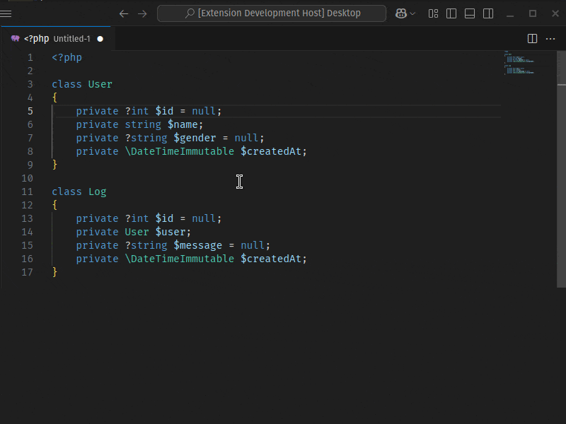

🇺🇸 [English](./README.md) - 🇧🇬 [Български](./README_BG.md) - 🇨🇿 [Čeština](./README_CS.md) - 🇩🇪 [Deutsch](./README_DE.md) - 🇪🇸 [Español](./README_ES.md) - 🇫🇷 [Français](./README_FR.md) - 🇭🇺 [Magyar](./README_HU.md) - 🇮🇹 [Italiano](./README_IT.md) - 🇯🇵 [日本語](./README_JA.md) - 🇰🇷 [한국어](./README_KO.md) - 🇵🇱 [Polski](./README_PL.md) - 🇧🇷 [Português - Brasil](./README_PT-BR.md) - 🇷🇺 [Русский](./README_RU.md) - 🇹🇷 [Türkçe](./README_TR.md) - 🇨🇳 [简体中文](./README_ZH-CN.md)/[繁體中文](./README_ZH-TW.md)

# PHP Getter und Setter Generator

Diese VS Code-Erweiterung wurde entwickelt, um den Workflow von PHP-Entwicklern zu beschleunigen. Sie generiert automatisch Getter- und Setter-Methoden sowie Konstruktoren für die `private` und `protected` Eigenschaften von Klassen in der aktuell geöffneten PHP-Datei. Im Gegensatz zu anderen ähnlichen Erweiterungen unterstützt diese Erweiterung Dateien, die mehrere Klassen enthalten, und ermöglicht es Ihnen, Eigenschaften für jede Klasse separat auszuwählen.

## Funktionen

- **Ein-Klick-Generierung:** Generieren Sie mit einem einzigen Klick Getter- und Setter-Methoden für Ihre PHP-Klasseneigenschaften.

- **Unterstützung mehrerer Klassen:** Wenn die Datei mehrere Klassen enthält, können Sie für jede Klasse separat Getter- und Setter-Methoden generieren.

- **Anpassbare Auswahl:** Bietet eine benutzerfreundliche Oberfläche, in der Sie die privaten Eigenschaften jeder Klasse separat auswählen können.

- **Auswahl der Methodeneinfügungsreihenfolge:** Getter- und Setter-Methoden können in verschiedenen Reihenfolgen in die Klasse eingefügt werden: zuerst Getter, zuerst Setter oder abwechselnd.

- **Konstruktorgenerierung:** Generiert automatisch Konstruktoren mit Typisierungshinweisen und Eigenschaftszuweisung.

- **Flexible Sortierung:** Generierte Getter/Setter-Methoden können alphabetisch (A-Z oder Z-A) oder nach der Reihenfolge sortiert werden, in der die Eigenschaften definiert sind.
- **Fluent Interface:** Unterstützung für Fluent Interface für Setter-Methoden zur Methodenverkettung.
- **Moderne PHP-Unterstützung:** Unterstützung für PHP 7+ Typdeklarationen.
- **Schnell und effizient:** Spart Ihnen Zeit, indem es Ihren Entwicklungsprozess beschleunigt.

## Verwendung

1. Öffnen Sie Ihre PHP-Datei.
2. Klicken Sie mit der rechten Maustaste oder öffnen Sie die Befehlspalette (Strg+Umschalt+P oder Cmd+Umschalt+P).
3. Wählen Sie "Getter und Setter generieren".
4. Getter und Setter werden automatisch generiert.

## Einstellungen

Diese Erweiterung bietet die folgenden Einstellungen:

- `phpgsg.getterSetterGenerator.autoGenerate`: Überspringt das Fenster für die schnelle Auswahl und generiert automatisch alle verfügbaren Getter/Setter-Methoden.
- `phpgsg.getterSetterGenerator.fluentInterface`: Fügt `return $this;` für Fluent Interface (Methodenverkettung) in Setter-Methoden hinzu.
- `phpgsg.getterSetterGenerator.indentSize`: Gibt die Größe eines Einzugs an (als Anzahl von Leerzeichen).
- `phpgsg.getterSetterGenerator.indentWithTab`: Verwendet das Tabulatorzeichen anstelle von Leerzeichen als Einzugszeichen. (die Option indentSize wird als 1 berechnet)
- `phpgsg.getterSetterGenerator.sortMethods`: Sie können Getter oder Setter priorisieren oder sie beim Anordnen von Methoden gemischt sortieren.
- `phpgsg.getterSetterGenerator.orderBy`: Sie können beim Sortieren von Methoden die alphabetische Sortierung oder die in der Klasse definierte Eigenschaftenreihenfolge wählen.
- `phpgsg.getterSetterGenerator.contextMenu.constructor`: Zeigt die Option "Konstruktor Generieren" im Kontextmenü an oder blendet sie aus.
- `phpgsg.getterSetterGenerator.contextMenu.getter`: Zeigt die Option "Getter Generieren" im Kontextmenü an oder blendet sie aus.
- `phpgsg.getterSetterGenerator.contextMenu.setter`: Zeigt die Option "Setter Generieren" im Kontextmenü an oder blendet sie aus.
- `phpgsg.getterSetterGenerator.contextMenu.getterAndSetter`: Zeigt die Option "Getter und Setter Generieren" im Kontextmenü an oder blendet sie aus.

## Installation

1. Öffnen Sie VS Code.
2. Öffnen Sie die Schnellöffnung (Strg+P).
3. Geben Sie Folgendes ein: `ext install tkinali.php-getter-setter-generator`

## Lizenz

Dieses Projekt ist unter der MIT-Lizenz lizenziert.

## Problem melden

Wenn Sie einen Fehler finden oder einen Vorschlag haben, melden Sie ihn bitte über GitHub Issues.