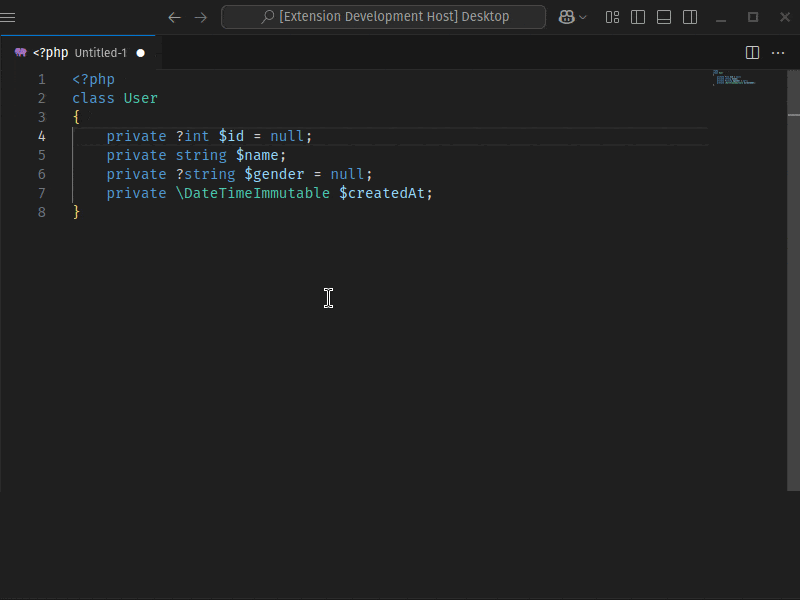
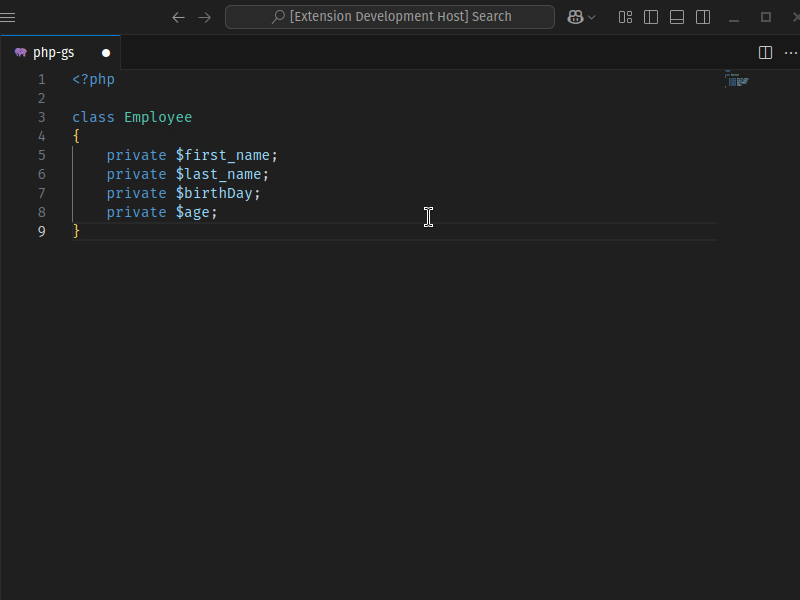

🇺🇸 [English](./README.md) - 🇧🇬 [Български](./README_BG.md) - 🇨🇿 [Čeština](./README_CS.md) - 🇩🇪 [Deutsch](./README_DE.md) - 🇪🇸 [Español](./README_ES.md) - 🇫🇷 [Français](./README_FR.md) - 🇭🇺 [Magyar](./README_HU.md) - 🇮🇹 [Italiano](./README_IT.md) - 🇯🇵 [日本語](./README_JA.md) - 🇰🇷 [한국어](./README_KO.md) - 🇵🇱 [Polski](./README_PL.md) - 🇧🇷 [Português - Brasil](./README_PT-BR.md) - 🇷🇺 [Русский](./README_RU.md) - 🇹🇷 [Türkçe](./README_TR.md) - 🇨🇳 [简体中文](./README_ZH-CN.md)/[繁體中文](./README_ZH-TW.md)

# Generator Getterów i Setterów PHP

Esta extensão do VS Code foi projetada para acelerar o fluxo de trabalho dos desenvolvedores PHP. Ela gera automaticamente métodos getter e setter e construtores para as propriedades `private` e `protected` das classes no arquivo PHP atualmente aberto. Ao contrário de outras extensões semelhantes, esta extensão suporta arquivos que contêm várias classes e permite selecionar propriedades separadamente para cada classe.

## Funkcje

- **Generowanie jednym kliknięciem:** Generuj metody getterów i setterów dla właściwości twojej klasy PHP jednym kliknięciem.

- **Obsługa wielu klas:** Jeśli plik zawiera wiele klas, możesz generować metody getterów i setterów oddzielnie dla każdej z nich.

- **Konfigurowalny wybór:** Zapewnia przyjazny dla użytkownika interfejs, w którym możesz oddzielnie wybierać prywatne właściwości każdej klasy.

- **Wybór kolejności wstawiania metod:** Metody getterów i setterów można wstawiać do klasy w różnych kolejnościach: najpierw gettery, najpierw settery lub naprzemiennie.

- **Geração de construtores:** Gera automaticamente construtores com dicas de tipo e atribuição de propriedades.

- **Elastyczne sortowanie:** Wygenerowane metody getterów/setterów można sortować alfabetycznie (A-Z lub Z-A) lub według kolejności, w jakiej zdefiniowano właściwości.
- **Płynny interfejs:** Obsługa płynnego interfejsu dla metod setterów w celu łańcuchowania metod.
- **Obsługa nowoczesnego PHP:** Obsługa deklaracji typów PHP 7+.
- **Szybkie i wydajne:** Oszczędza czas, przyspieszając proces rozwoju.

## Użycie

1. Otwórz swój plik PHP.
2. Kliknij prawym przyciskiem myszy lub otwórz paletę poleceń (Ctrl+Shift+P lub Cmd+Shift+P).
3. Wybierz "Generuj Gettery i Settery".
4. Gettery i settery zostaną wygenerowane automatycznie.

## Ustawienia

To rozszerzenie oferuje następujące ustawienia:

- `phpgsg.getterSetterGenerator.autoGenerate`: Pomija okno szybkiego wyboru i automatycznie generuje wszystkie dostępne metody getterów/setterów.
- `phpgsg.getterSetterGenerator.fluentInterface`: Dodaje `return $this;` dla płynnego interfejsu (łańcuchowanie metod) w metodach setterów.
- `phpgsg.getterSetterGenerator.indentSize`: Określa rozmiar wcięcia (jako liczbę spacji).
- `phpgsg.getterSetterGenerator.indentWithTab`: Używa znaku tabulacji jako znaku wcięcia zamiast spacji. (opcja indentSize jest obliczana jako 1)
- `phpgsg.getterSetterGenerator.sortMethods`: Możesz nadać priorytet getterom lub setterom, lub sortować je mieszanie podczas układania metod.
- `phpgsg.getterSetterGenerator.orderBy`: Możesz wybrać sortowanie alfabetyczne lub kolejność właściwości zdefiniowaną w klasie podczas sortowania metod.
- `phpgsg.getterSetterGenerator.contextMenu.constructor`: Mostra ou oculta a opção "Gerar Construtor" no menu de contexto.
- `phpgsg.getterSetterGenerator.contextMenu.getter`: Mostra ou oculta a opção "Gerar Getters" no menu de contexto.
- `phpgsg.getterSetterGenerator.contextMenu.setter`: Mostra ou oculta a opção "Gerar Setters" no menu de contexto.
- `phpgsg.getterSetterGenerator.contextMenu.getterAndSetter`: Mostra ou oculta a opção "Gerar Getters e Setters" no menu de contexto.

## Instalacja

1. Otwórz VS Code.
2. Otwórz Szybkie otwieranie (Ctrl+P).
3. Wpisz: `ext install tkinali.php-getter-setter-generator`

## Licencja

Ten projekt jest licencjonowany na licencji MIT.

## Zgłaszanie problemów

Jeśli znajdziesz błąd lub masz sugestię, zgłoś to za pośrednictwem GitHub Issues.