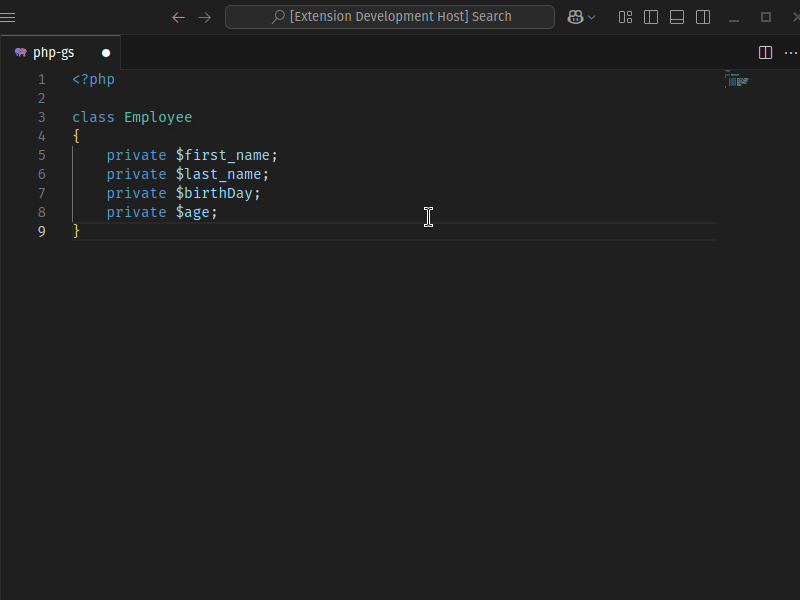

🇺🇸 [English](./README.md) - 🇧🇬 [Български](./README_BG.md) - 🇨🇿 [Čeština](./README_CS.md) - 🇩🇪 [Deutsch](./README_DE.md) - 🇪🇸 [Español](./README_ES.md) - 🇫🇷 [Français](./README_FR.md) - 🇭🇺 [Magyar](./README_HU.md) - 🇮🇹 [Italiano](./README_IT.md) - 🇯🇵 [日本語](./README_JA.md) - 🇰🇷 [한국어](./README_KO.md) - 🇵🇱 [Polski](./README_PL.md) - 🇧🇷 [Português - Brasil](./README_PT-BR.md) - 🇷🇺 [Русский](./README_RU.md) - 🇹🇷 [Türkçe](./README_TR.md) - 🇨🇳 [简体中文](./README_ZH-CN.md)/[繁體中文](./README_ZH-TW.md)

# Генератор геттеров и сеттеров PHP

Это расширение VS Code предназначено для ускорения рабочего процесса PHP-разработчиков. Оно автоматически генерирует методы getter и setter и конструкторы для `private` и `protected` свойств классов в текущем открытом PHP-файле. В отличие от других подобных расширений, это расширение поддерживает файлы, содержащие несколько классов, и позволяет выбирать свойства отдельно для каждого класса.

## Функции

- **Генерация в один клик:** Генерируйте методы геттеров и сеттеров для свойств вашего PHP-класса одним щелчком мыши.

- **Поддержка нескольких классов:** Если файл содержит несколько классов, вы можете генерировать методы геттеров и сеттеров отдельно для каждого из них.

- **Настраиваемый выбор:** Предоставляет удобный интерфейс, где вы можете выбирать частные свойства каждого класса отдельно.

- **Выбор порядка вставки методов:** Методы геттеров и сеттеров могут быть вставлены в класс в разных порядках: сначала геттеры, сначала сеттеры или чередуясь.

- **Генерация конструктора:** Автоматически генерирует конструкторы с подсказками типов и присваиванием свойств.

- **Гибкая сортировка:** Сгенерированные методы геттеров/сеттеров могут быть отсортированы в алфавитном порядке (A-Z или Z-A) или в соответствии с порядком, в котором определены свойства.
- **Текучий интерфейс:** Поддержка текучего интерфейса для методов сеттеров для цепочки методов.
- **Поддержка современного PHP:** Поддержка объявлений типов PHP 7+.
- **Быстро и эффективно:** Экономит ваше время, ускоряя процесс разработки.

## Использование

1. Откройте ваш PHP-файл.
2. Щелкните правой кнопкой мыши или откройте палитру команд (Ctrl+Shift+P или Cmd+Shift+P).
3. Выберите "Генерировать геттеры и сеттеры".
4. Геттеры и сеттеры будут сгенерированы автоматически.

## Настройки

Это расширение предоставляет следующие настройки:

- `phpgsg.getterSetterGenerator.autoGenerate`: Пропускает окно быстрого выбора и автоматически генерирует все доступные методы геттеров/сеттеров.
- `phpgsg.getterSetterGenerator.fluentInterface`: Добавляет `return $this;` для текучего интерфейса (цепочка методов) в методах сеттеров.
- `phpgsg.getterSetterGenerator.indentSize`: Определяет размер отступа (как количество пробелов).
- `phpgsg.getterSetterGenerator.indentWithTab`: Использует символ табуляции в качестве символа отступа вместо пробелов. (опция indentSize рассчитывается как 1)
- `phpgsg.getterSetterGenerator.sortMethods`: Вы можете установить приоритет геттеров или сеттеров, или сортировать их смешанно при упорядочивании методов.
- `phpgsg.getterSetterGenerator.orderBy`: Вы можете выбрать алфавитную сортировку или порядок свойств, определенный в классе, при сортировке методов.
- `phpgsg.getterSetterGenerator.contextMenu.constructor`: Показывает или скрывает опцию "Создать Конструктор" в контекстном меню.
- `phpgsg.getterSetterGenerator.contextMenu.getter`: Показывает или скрывает опцию "Создать Геттеры" в контекстном меню.
- `phpgsg.getterSetterGenerator.contextMenu.setter`: Показывает или скрывает опцию "Создать Сеттеры" в контекстном меню.
- `phpgsg.getterSetterGenerator.contextMenu.getterAndSetter`: Показывает или скрывает опцию "Создать Геттеры и Сеттеры" в контекстном меню.

## Установка

1. Откройте VS Code.
2. Откройте быстрое открытие (Ctrl+P).
3. Введите: `ext install tkinali.php-getter-setter-generator`

## Лицензия

Этот проект лицензирован под лицензией MIT.

## Сообщение о проблемах

Если вы обнаружите ошибку или у вас есть предложение, сообщите об этом через GitHub Issues.