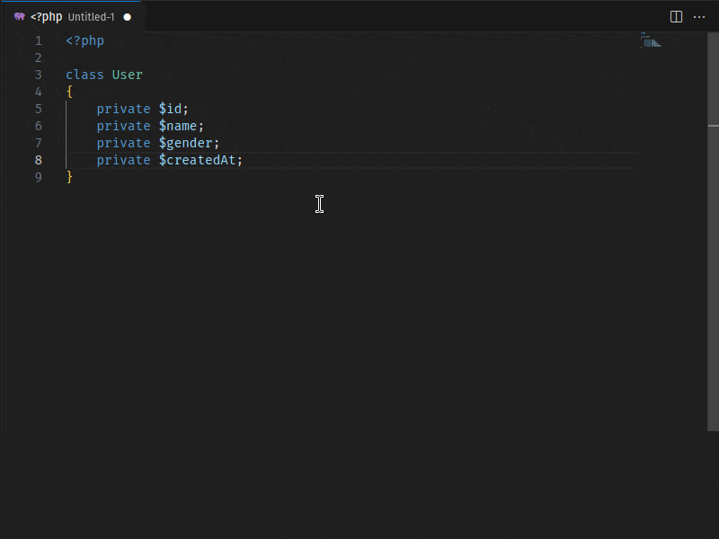
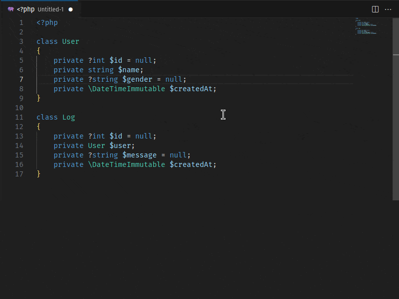
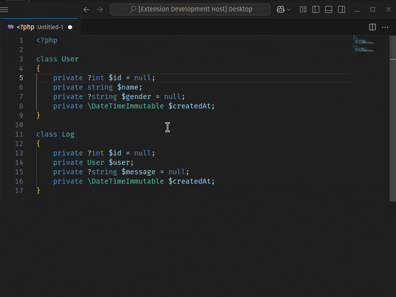
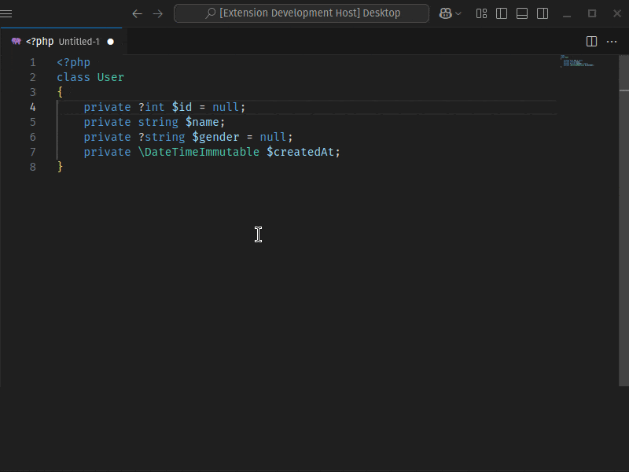

🇺🇸 [English](./README.md) - 🇧🇬 [Български](./README_BG.md) - 🇨🇿 [Čeština](./README_CS.md) - 🇩🇪 [Deutsch](./README_DE.md) - 🇪🇸 [Español](./README_ES.md) - 🇫🇷 [Français](./README_FR.md) - 🇭🇺 [Magyar](./README_HU.md) - 🇮🇹 [Italiano](./README_IT.md) - 🇯🇵 [日本語](./README_JA.md) - 🇰🇷 [한국어](./README_KO.md) - 🇵🇱 [Polski](./README_PL.md) - 🇧🇷 [Português - Brasil](./README_PT-BR.md) - 🇷🇺 [Русский](./README_RU.md) - 🇹🇷 [Türkçe](./README_TR.md) - 🇨🇳 [简体中文](./README_ZH-CN.md)/[繁體中文](./README_ZH-TW.md)

# PHP Getter 和 Setter 生成器

此 VS Code 扩展旨在加速 PHP 开发人员的工作流程。 它会自动为当前打开的 PHP 文件中的类的私有属性生成 getter 和 setter 方法。 与其他类似的扩展不同，此扩展支持包含多个类的文件，并允许您为每个类单独选择属性。

## 特点

- **一键生成：** 一键为您的 PHP 类属性生成 getter 和 setter 方法。

- **多类支持：** 如果文件包含多个类，您可以为每个类单独生成 getter 和 setter 方法。

- **可自定义选择：** 提供一个用户友好的界面，您可以在其中单独选择每个类的私有属性。

- **方法插入顺序选择：** getter 和 setter 方法可以以不同的顺序插入到类中：getter 优先，setter 优先或交替。

- **灵活排序：** 生成的 getter/setter 方法可以按字母顺序（A-Z 或 Z-A）或按定义属性的顺序排序。
- **流畅的接口：** 为 setter 方法提供流畅的接口支持，以实现方法链。
- **现代 PHP 支持：** 支持 PHP 7+ 类型声明。
- **快速高效：** 通过加速您的开发过程来节省您的时间。

## 用法

1. 打开您的 PHP 文件。
2. 右键单击或打开命令面板 (Ctrl+Shift+P 或 Cmd+Shift+P)。
3. 选择“生成 Getter 和 Setter”。
4. getter 和 setter 将自动生成。

## 设置

此扩展提供以下设置：

- `phpgsg.getterSetterGenerator.autoGenerate`：跳过快速选择窗口并自动生成所有可用的 getter/setter 方法。
- `phpgsg.getterSetterGenerator.fluentInterface`：在 setter 方法中添加 `return $this;` 以实现流畅的接口（方法链）。
- `phpgsg.getterSetterGenerator.indentSize`：指定缩进的大小（以空格数为单位）。
- `phpgsg.getterSetterGenerator.indentWithTab`：使用制表符代替空格作为缩进字符。 （indentSize 选项计算为 1）
- `phpgsg.getterSetterGenerator.sortMethods`：在排列方法时，您可以优先考虑 getter 或 setter，或者将它们混合排序。
- `phpgsg.getterSetterGenerator.orderBy`：在对方法进行排序时，您可以选择字母排序或类中定义的属性顺序。

## 安装

1. 打开 VS Code。
2. 打开快速打开 (Ctrl+P)。
3. 输入：`ext install tkinali.php-getter-setter-generator`

## 许可证

该项目根据 MIT 许可证获得许可。

## 问题报告

如果您发现错误或有建议，请通过 GitHub Issues 报告。